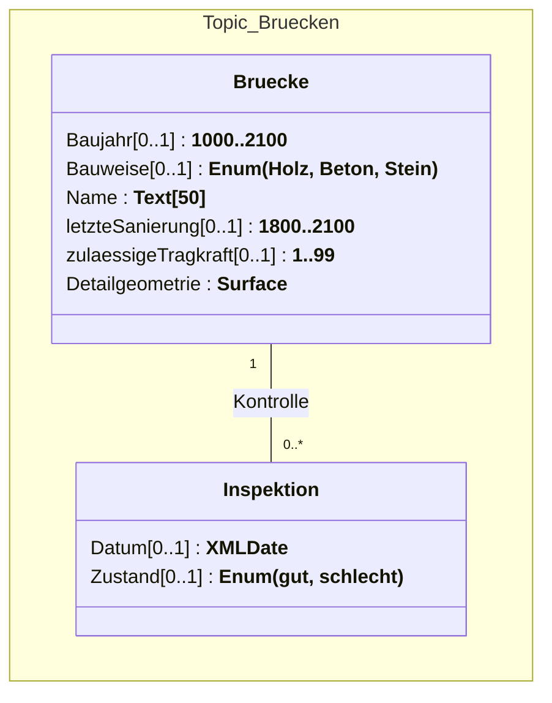
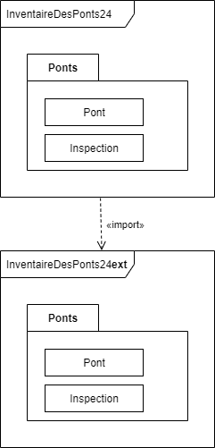

## Dokumentation zum Workshop 2: _Mehrsprachige INTERLIS-Datenmodelle in der Praxis_

### Ziele
- Der Workshop soll aufzeigen, wie mehrsprachige INTERLIS-Datenmodelle erstellt und angewandt werden. Dabei werden auch die Unterschiede zwischen INTERLIS 2.3 und INTERLIS 2.4 analysiert.

### Verwendete Software
- Ein Texteditor, vorzugsweise Visual Studio Code (als [Applikation](https://code.visualstudio.com/download#), oder als [portable Version](https://code.visualstudio.com/docs/editor/portable) für restriktive Systemumgebungen)
- Extensions für VS Code:
  - INTERLIS 2 (by GeoWerkstatt)
  - XML Tools (by Josh Johnson)
- QGIS v3.40 LTR [Download](https://qgis.org/download/)
  - QGIS Model Baker v8.0.4 (als Plug-In zu QGIS, via Menü _Plugin_ in QGIS)
- INTERLIS Compiler ili2c (via [interlis.ch](https://www.interlis.ch/downloads/ili2c))

### Installation
- Obige Software nach Bedarf installieren
- Prüfen, ob Java installiert ist:<br>
  `> java -version`
- Prüfen, ob ili2c funktioniert:<br>
  `> java -jar <Pfad-zu-ili2c.jar> --version`

### Übungsmodell
Für die Übungen in diesem Workshop wird folgendes Übungsmodell verwendet:



```python
INTERLIS 2.3;

MODEL Brueckeninventar23 (de) AT "https://models.moflex.ch"
  VERSION "29.10.2025" =

  IMPORTS GeometryCHLV95_V1;

  TOPIC Bruecken =

    CLASS Bruecke =
      Baujahr: 1000..2100;
      Bauweise: MANDATORY (Holz,Beton,Stein);
      Name: MANDATORY TEXT*50;
      letzteSanierung: 1800..2100;
      zulaessigeTragkraft: 1..99;
      Detailgeometrie: MANDATORY GeometryCHLV95_V1.Surface;
    END Bruecke;

    CLASS Inspektion =
      Datum: INTERLIS.XMLDate;
      Zustand: MANDATORY (gut,schlecht);
    END Inspektion;

    ASSOCIATION Kontrolle =
      rolle_a -- {1} Bruecke;
      rolle_b -- {0..*} Inspektion;
    END Kontrolle;

  END Bruecken;

END Brueckeninventar23.
```

Download [Brueckeninventar23.ili](models/Brueckeninventar23.ili)

### 1. Datenmodell mittels Model Baker in QGIS verfügbar machen

Das Datenmodell unter Verwendung von Model Baker in QGIS einlesen: 
- Im Model Baker Wizard
  - Option _Chose data files and models to import or generate a new database_ wählen.
  - (_Source Selection_): Datenmodell _Brueckeninventar23.ili_ als Quelle wählen.
  - (_Database Configuration_): Format _GeoPackage_ wählen und einen Dateinamen angeben.
  - (_Create Basket for Default Dataset_): Einstellungen belassen, -> _Create baskets_ wählen.
  - (_Generate a QGIS Project_): -> _Generate_ wählen.
  - (_Configure OID Generation_): Bei beiden Einträgen die Spalte _Default Value Expression_ auf `T_Id` setzen, -> _Finish_ wählen.

### 2. Daten in QGIS erfassen

> [!IMPORTANT]
> Damit QGIS korrekt mit GeoPackage arbeitet, muss der Transaktionsmodus (_Transacton mode_) korrekt gesetzt sein:
> Menü _Project -> Properties... ->_ in linker Spalte _Data Sources_ und anschliessend den _Transaction mode_ auf `Buffered Transaction Group` setzen.

- Ein Objekt im Layer _Bruecke_ erfassen, mit mindestens 1 zugehöriger Inspektion. Anschliessend Daten speichern.

### 3. Daten in QGIS validieren
- Menü _Database -> Model Baker -> Data Validator_

### 4. Daten exportieren
- Via Model Baker Wizard
  - Option _Export data from an existing database_ wählen.
  - (_Data Export Configuration_): Ort zum Speichern der .xtf-Datei wählen. Dateiname `export_bi23.xtf`

### 5. Daten betrachten
Betrachten wir die exportierte INTERLIS Transferdatei `export_bi23.xtf` im Texteditor, ist der für INTERLIS 2.3 typische Aufbau der XML-Elementnamen (_XML tags_) klar erkennbar:

```xml
...
<DATASECTION>
  <Brueckeninventar23.Bruecken BID="_e1dd4607-74f3-4c8d-bb47-3f75a467eaff">
    <Brueckeninventar23.Bruecken.Bruecke TID="3">
      <Baujahr>1950</Baujahr>
      <Bauweise>Holz</Bauweise>
      <Name>Europa-Brücke</Name>
      <letzteSanierung>1975</letzteSanierung>
      <zulaessigeTragkraft>8</zulaessigeTragkraft>
      <Detailgeometrie>
        <SURFACE>
          <BOUNDARY>
            <POLYLINE>
...
```

Die XML tags sind gemäss dem Schema _<Datenmodell-Name.Topic-Name.Klasse-Name>_ aufgebaut:

```xml
<Brueckeninventar23.Bruecken.Bruecke>
```

### 6. Übersetzungsdatei erzeugen (NLSXML)
Die Übersetzungdatei enthält eine strukturierte Auflistung aller Elemente des Datenmodells, welche in die Zielsprache(n) übersetzt werden können.

Die Übersetzungsdatei wird mit Hilfe des INTERLIS Compilers _ili2c_ erstellt.

Aufruf:

`java -jar ili2c.jar -oNLS --out <Neue-Übersetzungsdatei> <Zu-übersetzende-Modelldatei>`

also in unserem Fall:

`java -jar ili2c.jar -oNLS --out uebersetzung_bi23.xml Brueckeninventar23.ili`

### 7. Datenmodell übersetzen
In Übersetzungsdatei (uebersetzung_bi23.xml) die Daten in die jeweilige Sprache übersetzen. Für die Übersetzung nach Französisch dient folgende Tabelle:

#### Übersetzungstabelle Brückeninventar

| Deutsch               | Französisch                  | Französisch (INTERLIS Namen) |
| --------------------- | ---------------------------- | ---------------------------- |
| `Brueckeninventar23`  | _inventaire des ponts_       | `InventaireDesPonts23`       |
| `Bruecken`            | _ponts_                      | `Ponts`                      |
| `Bruecke`             | _pont_                       | `Pont`                       |
| `Baujahr`             | _année de construction_      | `AnneeDeConstruction`        |
| `Bauweise`            | _mode de construction_       | `ModeDeConstruction`         |
| > `Beton`             | _> beton_                    | > `beton`                    |
| > `Holz`              | _> bois_                     | > `bois`                     |
| > `Stein`             | _> pierre_                   | > `pierre`                   |
| `Detailgeometrie`     | _geométrie detaillée_        | `GeometrieDetaillee`         |
| `Name`                | _nom_                        | `Nom`                        |
| `letzteSanierung`     | _dernière rénovation_        | `DerniereRenovation`         |
| `zulaessigeTragkraft` | _charge maximale admissible_ | `ChargeMaximaleAdmissible`   |
|                       |                              |                              |
| `Inspektion`          | _inspection_                 | `Inspection`                 |
| `Datum`               | _date_                       | `Date`                       |
| `Zustand`             | _état_                       | `Etat`                       |
| > `gut`               | _> bon_                      | > `bon`                      |
| > `schlecht`          | _> mauvais_                  | > `mauvais`                  |
|                       |                              |                              |
| `Kontrolle`           | _contrôle_                   | `Controle`                   |

> [!NOTE]
> Die Bezeichnungen für Klassen und Attribute (sog. [INTERLIS Namen](https://geostandards-ch.github.io/doc_refhb24/#_namen)) dürfen keine Leerzeichen und keine diakritsche Zeichen (¨, ´, ` usw.) enthalten.

Bearbeitung der Übersetzungsdatei:

```xml
<?xml version="1.0" encoding="UTF-8" standalone="yes"?>
<IliModelElements>
  <element>
    <scopedName>Brueckeninventar23</scopedName>
    <elementType>MODEL</elementType>
    <name_de>Brueckeninventar23</name_de>
    <name_fr>InventaireDesPonts23</name_fr>   <- Übersetzung ergänzen
    <name_it>-</name_it>
    <name_en>-</name_en>
    <documentation_de>-</documentation_de>
    <documentation_fr>-</documentation_fr>
    <documentation_it>-</documentation_it>
    <documentation_en>-</documentation_en>
  </element>
  ...
  <element>
    <scopedName>Brueckeninventar23.Bruecken.Bruecke.Baujahr</scopedName>
    <elementType>ATTRIBUTE</elementType>
    <name_de>Baujahr</name_de>
    <name_fr>AnneeDeConstruction</name_fr>   <- Übersetzung ergänzen
    <name_it>-</name_it>
    <name_en>-</name_en>
    <documentation_de>-</documentation_de>
    <documentation_fr>-</documentation_fr>
    <documentation_it>-</documentation_it>
    <documentation_en>-</documentation_en>
  </element>
  ...
```

### 8. Übersetztes Datenmodell erzeugen
Aus dem Originalmodell (Brueckeninventar23.ili) wird zusammen mit der Übersetzungsdatei (uebersetzung_bi23.xml) das übersetzte Datenmodell (InventaireDesPonds23.ili). Die Übersetzung geschieht durch _ili2c_:

Aufruf:

`java -jar ili2c.jar -o2 --out <übersetztes-Modell.ili> --lang <Sprachkürzel> --nlsxml <Datei-mit-Übersetzungen.xml> <Originalmodell.ili>`

also in unserem Fall:

`java -jar ili2c.jar -o2 --out InventaireDesPonts23.ili --lang fr --nlsxml uebersetzung_bi23.xml Brueckeninventar23.ili`

Resultat:

```python
INTERLIS 2.3;

MODEL InventaireDesPonts23 (fr)                     !! Kürzel der Sprache
  AT "https://models.moflex.ch"
  VERSION "29.10.2025"
  TRANSLATION OF Brueckeninventar23 ["29.10.2025"]  !! Hinweis auf Originalmodell
  =
  IMPORTS GeometryCHLV95_V1;

  TOPIC Ponts =

    CLASS Pont =
      AnneeDeConstruction : 1000 .. 2100;
      ModeDeConstruction : MANDATORY (
        bois,
        beton,
        pierre
      );
  ...
```

### 9. Übersetztes Datenmodell validieren
Durch die Arbeit mit der Übersetzungsdatei ist zwar gewährleistet, dass die Struktur der beiden Datenmodelle identisch ist, jedoch können sich trotzdem Fehler eingeschlichen haben (z. B. Verletztung der Regeln betreffend INTERLIS Namen). Deshalb muss das übersetzte Datenmodell _InventaireDesPonts23.ili_ noch validiert werden mittels _ili2c_:

Aufruf:

`java -jar ili2c.jar InventaireDesPonts23.ili`

Falls Fehler gemeldet werden, so müssen die Übersetzungsdatei entsprechend korrigiert und das übersetzte Datenmodell neu erzeugt werden.

### 10. Übersetztes Datenmodell mittels Model Baker in QGIS verfügbar machen
Analog oben unter Kapitel 1, jedoch mit folgenden Änderungen:
- Als Quelle das übersetzte Datenmodell _InventaireDesPonds23.ili_ wählen.
- Im Schritt (_Generate a QGIS Project_) wird erkannt, dass es sich um ein übersetztes Datenmodell handelt. Deshalb wird bei der Option "Preferred language for database objects like tables and fields" nun auch Französisch angeboten. Bisher war dieses Feld deaktiviert. Hier also <kbd>French</kbd> auswählen.

### 11. Daten in QGIS erfassen und validieren
Analog oben Kapitel 2 und 3

### 12. Daten exportieren
#### 12.1 Export ohne Anpassung der Konfiguration
Analog oben unter Kapitel 4, jedoch mit folgenden Änderungen:
- (_Data Export Configuration_): Ort zum Speichern der .xtf-Datei wählen. Dateiname `export_ip23.xtf`

#### 12.2 Daten betrachten
Betrachten wir die exportierte INTERLIS Transferdatei `export_ip23.xtf` im Texteditor:

```xml
...
<DATASECTION>
  <Brueckeninventar23.Bruecken BID="_126a075f-7e6a-41ed-8dd4-49fdf207bd60">
    <Brueckeninventar23.Bruecken.Bruecke TID="3">
      <Baujahr>1951</Baujahr>
      <Bauweise>Holz</Bauweise>
      <Name>Kornhaus-Brücke</Name>
      <letzteSanierung>1976</letzteSanierung>
      <zulaessigeTragkraft>9</zulaessigeTragkraft>
      <Detailgeometrie>
        <SURFACE>
          <BOUNDARY>
            <POLYLINE>
...
```

Die XML tags sind in Deutsch, genauso wie die Aufzählwerte:

```xml
<Brueckeninventar23.Bruecken.Bruecke>
```
```xml
<Bauweise>Holz</Bauweise>
```

#### 12.3 Export _mit_ Anpassung der Konfiguration
- Dateiname `export_ip23_fr.xtf`
- (_Data Export Session_): Auf das Pfeilsymbol neben der Schaltfläche <kbd>Run</kbd> klicken:
  - _Edit ili2db command_ auswählen
  - Im Editierfenster nach dem Eintrag `--models Brueckeninventar23` suchen
  - Im Anschluss an obige Zeichenkette folgende Option ergänzen: `--exportModels InventaireDesPonts23`

#### 12.4 Daten betrachten
Betrachten wir die exportierte INTERLIS Transferdatei `export_ip23_fr.xtf` im Texteditor:

```xml
...
<DATASECTION>
  <InventaireDesPonts23.Ponts BID="_126a075f-7e6a-41ed-8dd4-49fdf207bd60">
    <InventaireDesPonts23.Ponts.Pont TID="3">
      <AnneeDeConstruction>1951</AnneeDeConstruction>
      <ModeDeConstruction>bois</ModeDeConstruction>
      <Nom>Kornhaus-Brücke</Nom>
      <DerniereRenovation>1976</DerniereRenovation>
      <ChargeMaximaleAdmissible>9</ChargeMaximaleAdmissible>
      <GeometrieDetaillee>
        <SURFACE>
          <BOUNDARY>
            <POLYLINE>
...
```

Die XML tags sind nun in Französisch, genauso wie die Aufzählwerte:

```xml
<InventaireDesPonts23.Ponts.Pont>
```
```xml
<ModeDeConstruction>bois</ModeDeConstruction>
```

### 13. Umgang mit INTERLIS 2.4
Das Datenmodell in INTERLIS 2.4 unterscheidet sich nur wenig von demjenigen in INTERLIS 2.3:

```diff
-INTERLIS 2.3;
+INTERLIS 2.4;

-MODEL Brueckeninventar23 (de) AT "https://models.moflex.ch"
+MODEL Brueckeninventar24 (de) AT "https://models.moflex.ch"
  VERSION "29.10.2025" =

-  IMPORTS GeometryCHLV95_V1;
+  IMPORTS GeometryCHLV95_V2;

  TOPIC Bruecken =

    CLASS Bruecke =
      Baujahr: 1000..2100;
      Bauweise: MANDATORY (Holz,Beton,Stein);
      Name: MANDATORY TEXT*50;
      letzteSanierung: 1800..2100;
      zulaessigeTragkraft: 1..99;
-      Detailgeometrie: MANDATORY GeometryCHLV95_V1.Surface;
+      Detailgeometrie: MANDATORY GeometryCHLV95_V2.Surface;
    END Bruecke;

    CLASS Inspektion =
      Datum: INTERLIS.XMLDate;
      Zustand: MANDATORY (gut,schlecht);
    END Inspektion;

    ASSOCIATION Kontrolle =
      rolle_a -- {1} Bruecke;
      rolle_b -- {0..*} Inspektion;
    END Kontrolle;

  END Bruecken;

-END Brueckeninventar23.
+END Brueckeninventar24.
```

Neben der Umbenennung des Modellnamens muss mit `GeometryCHLV95_V2` (_\_V2_ statt _\_V1_) auch ein anderes Geometriemodell verwendet werden, da sich Datenmodelle nicht versionsübergreifend nutzen lassen. Das Datenmodell [GeometryCHLV95_V2](https://models.geo.admin.ch/CH/CHBase_Part1_GEOMETRY_V2.ili) ist ebenfalls in INTERLIS 2.4 geschrieben.

Download [Brueckeninventar24.ili](models/Brueckeninventar24.ili)

### 14. Datenmodell mittels Model Baker in QGIS verfügbar machen

### 15. Daten in QGIS erfassen und validieren

### 16. Daten exportieren
- Dateiname: `export_bi24.xtf`

### 17. Daten betrachten
Betrachten wir die exportierte INTERLIS Transferdatei `export_bi24.xtf` im Texteditor:

```xml
...
<ili:datasection>
  <Brueckeninventar24:Bruecken ili:bid="_82236fe5-a28f-45fd-a826-2d4ae7005b4b">
    <Brueckeninventar24:Bruecke ili:tid="3">
      <Brueckeninventar24:Baujahr>1960</Brueckeninventar24:Baujahr>
      <Brueckeninventar24:Bauweise>Stein</Brueckeninventar24:Bauweise>
      <Brueckeninventar24:Name>Ponti dei Salti</Brueckeninventar24:Name>
      <Brueckeninventar24:letzteSanierung>1980</Brueckeninventar24:letzteSanierung>
      <Brueckeninventar24:zulaessigeTragkraft>3</Brueckeninventar24:zulaessigeTragkraft>
      <Brueckeninventar24:Detailgeometrie>
        <geom:surface>
          <geom:exterior>
            <geom:polyline>
...
```

Die XML tags sind in Deutsch, haben jedoch neu einen Präfix, der durch einen Doppelpunkt `:` abgetrennt ist: den sogenannten [XML Namensraum (_namespace_)](https://de.wikipedia.org/wiki/Namensraum_(XML)):

```xml
<Brueckeninventar24:Bruecke>
```
```xml
<Brueckeninventar24:Bauweise>Holz</Brueckeninventar24:Bauweise>
```

Als Vergleich nochmals das Transferformat von INTERLIS 2.3:

```xml
...
<DATASECTION>
  <Brueckeninventar23.Bruecken BID="_126a075f-7e6a-41ed-8dd4-49fdf207bd60">
    <Brueckeninventar23.Bruecken.Bruecke TID="3">
      <Baujahr>1951</Baujahr>
      <Bauweise>Holz</Bauweise>
      <Name>Kornhaus-Brücke</Name>
      <letzteSanierung>1976</letzteSanierung>
      <zulaessigeTragkraft>9</zulaessigeTragkraft>
      <Detailgeometrie>
        <SURFACE>
          <BOUNDARY>
            <POLYLINE>
...
```

### 18. Datenmodell übersetzen
Als Übersetzungsdatei kann diejenige Datei verwendet werden, welche für die Herstellung des übersetzten Modells in INTERLIS 2.3 hergehalten hat (uebersetzung_bi23.xml). Einzig die Modellbezeichnung muss korrigiert werden (`Brueckeninventar23` --> `Brueckeninventar24`). Dies kann durch Suchen/Ersetzen im Texteditor erfolgen. Die geänderte Datei anschliessend unter `uebersetzung_bi24.xml` speichern.

### 19. Übersetztes Datenmodell erzeugen
Aus dem Originalmodell (Brueckeninventar24.ili) wird zusammen mit der Übersetzungsdatei (uebersetzung_bi24.xml) das übersetzte Datenmodell (InventaireDesPonds24.ili). Die Übersetzung geschieht durch _ili2c_. Aufruf siehe Kapitel 8.

### 20. Übersetztes Datenmodell validieren
(siehe Kapitel 9)

### 21. Übersetztes Datenmodell mittels Model Baker in QGIS verfügbar machen
- Als Quelle das übersetzte Datenmodell _InventaireDesPonds24.ili_ wählen.
- Im Schritt (_Generate a QGIS Project_) unter "Preferred language for database objects like tables and fields" <kbd>French</kbd> auswählen.

### 22. Daten in QGIS erfassen und validieren
Analog Kapitel 2 und 3

### 23. Daten exportieren
#### 23.1 Export ohne Anpassung der Konfiguration
- Dateiname `export_ip24.xtf`

#### 23.2 Daten betrachten
Die Daten sind in Deutsch, was korrekt ist.

#### 23.3 Export _mit_ Anpassung der Konfiguration
- Dateiname `export_ip24_fr.xtf`
- (_Data Export Session_): Auf das Pfeilsymbol neben der Schaltfläche <kbd>Run</kbd> klicken:
  - _Edit ili2db command_ auswählen
  - Im Editierfenster nach dem Eintrag `--models Brueckeninventar24` suchen
  - Im Anschluss an obige Zeichenkette folgende Option ergänzen: `--exportModels InventaireDesPonts24`

Der anschliessende Versuch eines Exports scheitert mit folgender Fehlermeldung:
_INTERLIS 2.4 transfers must be in the base language. The basket InventaireDesPonts24.Ponts has language (fr), the base has (de)_

> [!IMPORTANT]
> In INTERLIS 2.4 gibt es nur noch eine (1) Form der Transferdatei. Diese wird durch die verwendete natürliche Sprache im Originalmodell festgelegt (siehe [Referenzhandbuch INTERLIS 2.4](https://geostandards-ch.github.io/doc_refhb24/#_allgemeiner_aufbau_der_transferdatei)). In unserem Fall ist die Originalsprache (de) und deshalb ist ein Export in eine andere Sprache nicht zugelassen.

### 24. Option Modellerweiterung - Fluch oder Segen?
Die objektorientierte Modellierung, worauf INTERLIS 2 basiert, lässt es grundsätzlich zu, dass Modelle erweitert werden. Kann man also ein übersetztes Datenmodell so erweitern, dass die Transferdatei nicht in der Originalsprache erscheint, sondern in der übersetzten Sprache?



Das entsprechende INTERLIS Datenmodell sieht so aus:

```python
INTERLIS 2.4;

MODEL InventaireDesPonts24ext (fr)
  AT "https://models.moflex.ch"
  VERSION "29.10.2025"
  =
  IMPORTS InventaireDesPonts24;

  TOPIC Ponts EXTENDS InventaireDesPonts24.Ponts=

    !!@ ili2db.dispName = "Pont extended"
    CLASS Pont (EXTENDED) =
    END Pont;

    !!@ ili2db.dispName = "Inspection du pont extended"
    CLASS Inspection (EXTENDED) =
    END Inspection;

    ASSOCIATION Controle (EXTENDED) =
      rolle_a (EXTENDED) -- {1} Pont;
      rolle_b (EXTENDED) -- {0..*} Inspection;
    END Controle;

  END Ponts;

END InventaireDesPonts24ext.
```

Es müssen also nicht alle Attribute nochmals erfasst, sondern nur die Klassen und Assoziation erweitert werden.

> [!NOTE]
> Mit Hilfe des Meta-Attributs `!!@ ili2db.dispName` können sprechende Namen für Klassen, Attribute und Aufzählwerte vergeben werden. Diese werden bei der Erstellung des QGIS-Projekts für die Beschrifungen von Layer, Felder und Aufzählwerten verwendet (anstatt der Standardbezeichungen aus dem Datenmodell).

### 25. Datenmodell mittels Model Baker in QGIS verfügbar machen

### 26. Daten in QGIS erfassen und validieren

### 27. Daten exportieren
- Dateiname: `export_ip24ext.xtf`

### 28. Daten betrachten
Betrachten wir die exportierte INTERLIS Transferdatei `export_ip24ext.xtf` im Texteditor:

```xml
...
<ili:datasection>
  <InventaireDesPonts24ext:Ponts ili:bid="_545c0bb7-640a-4aa1-8af6-56ae73154f18">
    <InventaireDesPonts24ext:Pont ili:tid="3">
      <InventaireDesPonts24:AnneeDeConstruction>1950</InventaireDesPonts24:AnneeDeConstruction>
      <InventaireDesPonts24:ModeDeConstruction>bois</InventaireDesPonts24:ModeDeConstruction>
      <InventaireDesPonts24:Nom>Erweiterte Brücke</InventaireDesPonts24:Nom>
      <InventaireDesPonts24:DerniereRenovation>1975</InventaireDesPonts24:DerniereRenovation>
      <InventaireDesPonts24:ChargeMaximaleAdmissible>10</InventaireDesPonts24:ChargeMaximaleAdmissible>
      <InventaireDesPonts24:GeometrieDetaillee>
        <geom:surface>
          <geom:exterior>
            <geom:polyline>
...
```

Die XML tags sind zwar nun in französisch, aber sie enthalten unterschiedliche Namespaces:

```xml
<InventaireDesPonts24ext:Pont>
                      ^
                      |
                      |
                     ext
```
```xml
<InventaireDesPonts24:ModeDeConstruction>bois</InventaireDesPonts24:ModeDeConstruction>
                     ^                                             ^
                     |                                             |
                     |                                             |
                 kein ext                                      kein ext
```

Die exportierten Daten sind zwar gültig im Datenmodell `InventaireDesPonts24ext`, jedoch nicht mit Datenmodell `InventaireDesPonts24`. Daher hält sich der Mehrwert in Grenzen.