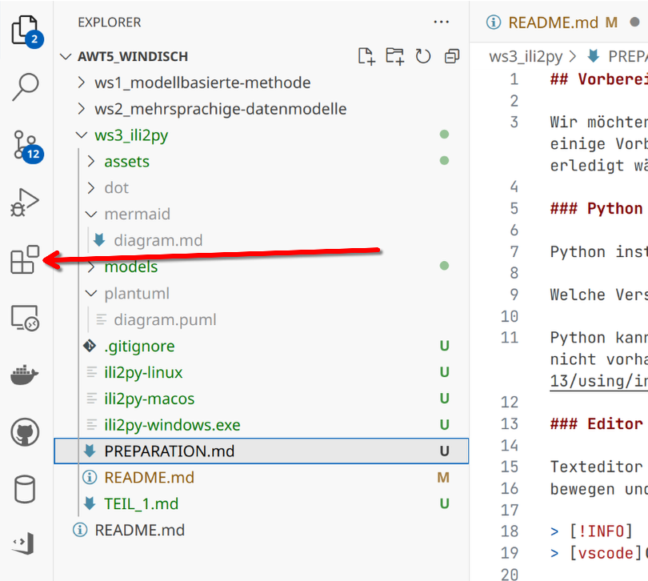
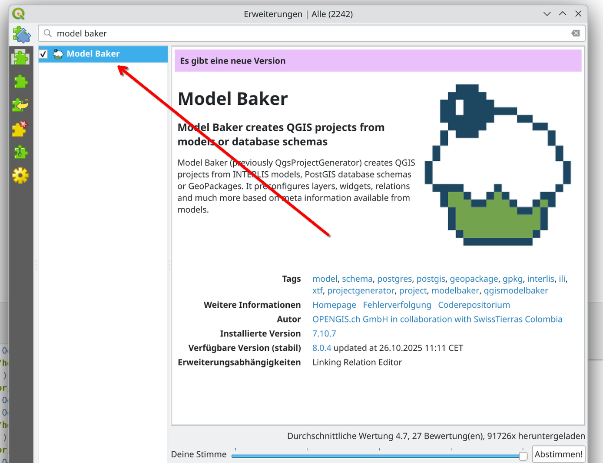

## Vorbereitungen zum Workshop

Wir möchten uns die Python Bibliothek ilipy näher anschauen. Dazu sind je nach dem wie sehr man mitmachen möchte, einige Vorbediungen zu erfüllen. Es wäre am besten wenn insbesondere die Installationen bereits vor dem Workshop erledigt wären.

### Python

Python installation (mindestens 3.11, 3.13 empfohlen)

Welche Version haben ich? => `python --version` in Kommandozeile eingeben

Python kann 🔽[hier](https://www.python.org/downloads/release/python-3138/)🔽 heruntergeladen werden falls noch nicht vorhanden. Nützliche Infos zu verschiedenen Betriebssystemen findet man 📘[hier](https://docs.python.org/3.13/using/index.html)📘.

### Editor

Texteditor (eine IDE ist von Vorteil) zum inspizieren von Python Code. Wir werden uns durch strukturierten Code
bewegen und daher sind Funktionen wie _go to definition_ hilfreich.

> [!INFO]
> [vscode](https://code.visualstudio.com/Download) installieren

 
Plugins installiert man über das Menü links (dann die Suche verwenden!)

In Vscode folgende Plugins installieren.
  
- Python
- Python Debugger
- PlantUML
- Markdown Preview Mermaid Support

### QGIS

Wir werden mit Interlis Modellen und auch mit Interlisdaten umgehen. Deshalb ist es gut, QGIS installiert zu haben. Es kann 🔽[hier](https://qgis.org/download/)🔽 heruntergeladen werden.
Die dokumentation zu QGIS findet sich 📘[hier](https://docs.qgis.org/3.40/de/docs/user_manual/index.html)📘.

In QGIS sollte unbedingt das [QGIS Model Baker](https://github.com/opengisch/QgisModelBaker) Plugin installiert werden:

Die zugehörige Dokumentation findet man 📘[hier](https://opengisch.github.io/QgisModelBaker/de/)📘

