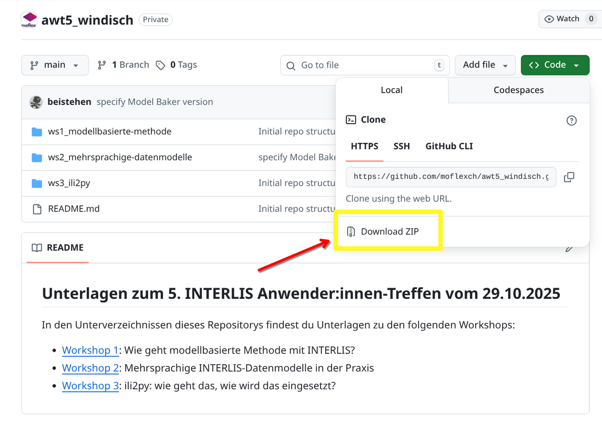

## Dokumentation zum Workshop 3: _ili2py: wie geht das, wie wird das eingesetzt?_

### Vorbereitung zum Workshop

Zur Vorbereitung bitte [dieser](PREPARATION.md) Beschreibung folgen.

### ili2py

Die aktuelle Implementierung stützt sich auf das [_IlisMeta16_](https://models.interlis.ch/core/IlisMeta16.ili) Metamodell ([Dokumentation](https://www.interlis.ch/download/interlis2/ili24-metamodel_2022-06-17_d.pdf)). Im Folgenden werde ich IlisMeta16 immer mal wieder mit IMD16 abkürzen.

Einfach beschrieben liest ili2py ein beliebiges XTF dieses Modells ein, übersetzt die Elemente in seine internen
Repräsentationen und rendert dann die gewünschte Ausgabe. Das Ganze ist so aufgebaut, dass es nicht nur als Kommandozeilenwerkzeug eingesetzt werden kann, sonder auch als Bibliothek in Python.

Deshalb ist der Name aktuell etwas irreführend. ili2py kann aktuell keine ili-Dateien lesen oder schreiben. Alles ist auf dem Metamodell aufgebaut.

Ein Metamodell ist eine Ableitung eines normalen ili-Models. Es kann mit verschiedenen Werkzeugen aus einem ili-Modell erstellt werden.

Stellvertretend hier mal am Beispiel von [ili2c](https://github.com/claeis/ili2c) (Version 5.6.6 => [Download](https://downloads.interlis.ch/ili2c/ili2c-5.6.6.zip)) gezeigt:

```shell
java -jar <pfad-zu-ili2c-jar> -oIMD16 --out models/OeREBKRMtrsfr_V2_0.imd models/OeREBKRMtrsfr_V2_0.ili
```

### Start

----

<p align="center" width="100%" style="color:red;font-size:30px">
<b>https://github.com/moflexch/awt5_windisch</b>
</p>

----

<p align="center" width="100%">
</br>
Auf GitHub laden wir uns das Workshop Material herunter
</p>

- Zip irgendwo entpacken.
- Entstandenen Ordner und dort den Unterordner `ws3_ili2py` im Edior öffnen. Ich werde vscode nutzen.
- Terminal öffnen in diesem Ordner öffnen

### ili2py CLI (Binary)

Das _Command Line Interface_ von ili2py bietet neben dem Hauptkommando `ili2py` noch zwei Subkommandos:

- `diagram`
- `python-classes`

Schauen wir uns also an, wie man das Ganze grundsätzlich nutzt.

#### Hauptkommando

> [!TIP]
> Eventuell muss einmalig `chmod +x ili2py-linux`/ `chmod +x ili2py-macos` ausgeführt werden.

```shell
# Linux (evtl. chmod +x ili2py-linux)
./ili2py-linux

# Mac (evtl. chmod +x ili2py-macos)
./ili2py-macos

# Windows
ili2py-windows.exe
```

Ausgabe ist:
```
Usage: ili2py-linux [OPTIONS] COMMAND [ARGS]...

Options:
  -v, --verbose  Print debug information
  -V, --version  Show the version and exit.
  --help         Show this message and exit.

Commands:
  diagram         Parses an arbitrary IMD16 and creates and creates a...
  python-classes  Parses an arbitrary imd and creates a library of python...
```

> [!TIP]
> Dieselbe Ausgabe erreichen wir auch mit `--help`

```shell
# Linux
./ili2py-linux --help

# Mac
./ili2py-macos --help

# Windows
ili2py-windows.exe --help
```

Mit `-V`/`--version` kann die vorliegende Version angezeigt werden.

```shell
# Linux
./ili2py-linux --V
./ili2py-linux --version

# Mac
./ili2py-macos --V
./ili2py-macos --version

# Windows
ili2py-windows.exe --V
ili2py-windows.exe --version
```

Ausgabe:
```
ili2py 0.0.1 from ./ili2py-linux (Python 3.13.7)
```

> [!NOTE]  
> Der Parameter `-v`/`--verbose` wird nur im Zusammenhang mit den Subkommandos benötig.

---

#### Subkommando `diagram`

Erstellt aus einem Ilismeta16 ein Diagramm nach Wahl.

> [!INFO]
> ili2py nicht das Bild. Es erstellt die jeweilige Textrepäsentation. Das erstellen des Bildes selber muss durch die jeweiligen Werkzeuge sichergestellt werden.

```shell
# Linux
./ili2py-linux diagram --help

# Mac
./ili2py-macos diagram --help

# Windows
ili2py-windows.exe diagram --help
```

Ausgabe:
```
[XX:XX:XX] INFO     INFO: Starting ili2py CLI
           INFO     INFO: ili2py 0.0.1 from ./ili2py-linux (Python 3.13.7)
Usage: ili2py-linux diagram [OPTIONS]

  Parses an arbitrary IMD16 and creates and creates a diagram of selected
  flavour representing the selected models.

Options:
  -i, --imd TEXT            full path to IMD16 file  [required]
  -o, --output_folder TEXT  Path to the folder where the python package should
                            be written to. The folder will be created if not
                            existing.  [required]
  -f, --flavour TEXT        the desired flavour (one of mermaid, plantuml,
                            dot)  [default: mermaid]
  -d, --direction TEXT      the desired direction, depending on the selected
                            flavour (one of mermaid: ['LR', 'RL', 'TD', 'DT'],
                            plantuml: ['top to bottom', 'left to right'], dot:
                            [])
  -l, --linetype TEXT       the desired linetype, depending on the selected
                            flavour (one of mermaid: [], plantuml:
                            ['polyline', 'ortho', 'spline'], dot: [])
  -n, --file_name TEXT      The name of the output diagram. The postfix (md,
                            puml, etc. is added automatically due to selected
                            flavour).  [default: diagram]
  -m, --models TEXT         Model names separated by comma. This is used to
                            filter the content of the resulting diagram. If
                            not provided, the full tree will be drawn.
  -h, --help                Show this message and exit.
  ```

Die Pflichtparameter beim aufruf von `diagram` sind der Pfad zum Metamodell `-i`/`--imd` (nur IMD16 ist erlaubt!) und der Pfad in den das Resultat geschrieben werden soll `-o`/`--output_folder`. Es wird im `output_folder` ein Unterordner mit dem Namen des Flavours angelegt.

Alle anderen Parameter sind fakultativ.

`-f`/`--flavour` => Welcher Diagrammtyp soll ausgegeben werden. Umgesetzt sind aktuell `plantuml`, `mermaid`, `dot` (experimentell). Standardmässig wird nach `mermaid` gerendert.

`-d`/`--direction` => in welche Richtung soll das Diagram angelegt werden. Das ist abhängig vom gewählten Diagrammtyp:

- `mermaid` => `LR`, `RL`, `TD`, `DT` => standard `LR`
- `plantuml` => `'top to bottom'`, `'left to right'`  => standard `'top to bottom'`
- `dot` => Keine Richtungen wählbar

`-l`/`--linetype` => Welcher Art sollen die Verbinder zwischen den Klassen sein. Das ist abhängig vom gewählten Diagrammtyp:

- `mermaid` => Keine Verbindertypen wählbar
- `plantuml` => `polyline`, `ortho`, `spline`
- `dot` => Keine Verbindertypen wählbar

`-n`/`--file_name` => Der Name der Diagrammdatei. Ohne Dateiendung. Diese wird durch den Diagrammtyp bestimmt und automatisch angefügt.

`-m`/`--models` => Eine kommaseparierte Liste von Modellnamen. Diese dienen als Selektionsfilter für das Erzeugte Diagramm. Es werden nur die Modelle im Diagramm gezeichnet die in der Liste sind. Ist die Liste leer (Standard) werden alle Elemente aller Modelle gezeichnet.

> [!INFO]
> Wenn Kommandozeilenparameter Leerzeichen (Spaces) enthalten, müssen sie mit Anführungszeichen `'a b c'` oder `"a b c"` eingefasst sein!

Folgender Befehl erzeugt ein mermaid diagramm (Markdown Datei) in dem Elemente des Modells `OeREBKRMtrsfr_V2_0` enthalten sind (Filter) im Ordner `mermaid`. Die Datei heisst `diagram.md`

```shell
# Linux
./ili2py-linux diagram -i models/OeREBKRMtrsfr_V2_0/OeREBKRMtrsfr_V2_0.imd -o ./ -m OeREBKRMtrsfr_V2_0

# Mac
./ili2py-macos diagram -i models/OeREBKRMtrsfr_V2_0/OeREBKRMtrsfr_V2_0.imd -o ./ -m OeREBKRMtrsfr_V2_0

# Windows
ili2py-windows.exe diagram -i models\OeREBKRMtrsfr_V2_0\OeREBKRMtrsfr_V2_0.imd -o .\ -m OeREBKRMtrsfr_V2_0
```

Folgender Befehl erzeugt dasselbe Diagramm, liefert aber mehr Logging-Ausgabe. Das kann im Fehlerfall nützlich sein.

```shell
# Linux
./ili2py-linux -v diagram -i models/OeREBKRMtrsfr_V2_0/OeREBKRMtrsfr_V2_0.imd -o ./ -m OeREBKRMtrsfr_V2_0

# Mac
./ili2py-macos -v diagram -i models/OeREBKRMtrsfr_V2_0/OeREBKRMtrsfr_V2_0.imd -o ./ -m OeREBKRMtrsfr_V2_0

# Windows
ili2py-windows.exe -v diagram -i models\OeREBKRMtrsfr_V2_0\OeREBKRMtrsfr_V2_0.imd -o .\ -m OeREBKRMtrsfr_V2_0
```

Nun kann jeder mal frei ausprobieren.

#### Subkommando `python-classes`

Erstellt aus einem Ilismeta16 eine komplette eigenständige Python Klassenbibliothek mit sauberem Typing.

```shell
# Linux
./ili2py-linux python-classes --help

# Mac
./ili2py-macos python-classes --help

# Windows
ili2py-windows.exe python-classes --help
```

Ausgabe:
```
[XX:XX:XX] INFO     INFO: Starting ili2py CLI
           INFO     INFO: ili2py 0.0.1 from ./ili2py-linux (Python 3.13.7)
Usage: ili2py-linux python-classes [OPTIONS]

  Parses an arbitrary imd and creates a library of python classes which
  represents a typed interface to the complete construction.

Options:
  -i, --imd TEXT            full path to imd file  [required]
  -o, --output_folder TEXT  Path to where the python package should be written
                            [required]
  -l, --library_name TEXT   Library name which will be used to assemble all
                            python structures in.  [required]
  -h, --help                Show this message and exit.
```

Die Pflichtparameter beim aufruf von `python-classes` sind der Pfad zum Metamodell `-i`/`--imd` (nur IMD16 ist erlaubt!) und der Pfad in den das Resultat geschrieben werden soll `-o`/`--output_folder`. Es wird im `output_folder` ein Unterordner mit dem Namen der Bibliothek angelegt.

`-l`/`--library_name` => Der Name den die Bibliothek haben soll. Dies darf auch ein durch punkte separierter Name sein. Dann wird die Bibliothek intern so erstellt, dass die Namensauflösung der Imports immer mit diesem Pfad gemacht werden. Der Ordner ist aber immer der letzte Abschnitt des punkt separierten Namens. Das dient zur einfacheren Integration in bereits exestierende Software.

> [!INFO]
> Wenn der Name `ili2py.interfaces.interlis.OeREBKRMtrsfr_V2_0` ist, wird die Bibliothek trotzdem im Ordner `OeREBKRMtrsfr_V2_0` erstellt. Man kann diesen dann aber nach Wunsch an die richtige Stelle in seiner Bibliothek kopieren. Die Referenzauflösung funktioniert dann transparent.

Folgender Befehl erstellt die Python Bibliothek im Ordner `OeREBKRMtrsfr_V2_0`:

```shell
# Linux
./ili2py-linux python-classes -i models/OeREBKRMtrsfr_V2_0/OeREBKRMtrsfr_V2_0.imd -o ./ -l interface

# Mac
./ili2py-macos python-classes -i models/OeREBKRMtrsfr_V2_0/OeREBKRMtrsfr_V2_0.imd -o ./ -l interface

# Windows
ili2py-windows.exe python-classes -i models\OeREBKRMtrsfr_V2_0\OeREBKRMtrsfr_V2_0.imd -o .\ -l interface
```

Nun kann man im Editor die 


Folgender Befehl erzeugt dieselbe Bibliothek, liefert aber mehr Logging-Ausgabe. Das kann im Fehlerfall nützlich sein.

```shell
# Linux
./ili2py-linux python-classes -i models/OeREBKRMtrsfr_V2_0/OeREBKRMtrsfr_V2_0.imd -o ./ -l interface

# Mac
./ili2py-macos python-classes -i models/OeREBKRMtrsfr_V2_0/OeREBKRMtrsfr_V2_0.imd -o ./ -l interface

# Windows
ili2py-windows.exe python-classes -i models\OeREBKRMtrsfr_V2_0\OeREBKRMtrsfr_V2_0.imd -o .\ -l interface
```

---

<p align="center" width="100%" style="color:red;font-size:90px">
<b>PAUSE</b>
</p>

---

### ili2py Demonstrator

Dieser Teil ist als Unterstützung der Diskussion gedacht. Alle benötigten Dinge sind vorhanden. Ich werde es kurz durchspielen und zeigen.

Ablauf:

1. Modell auswählen zu dem auch Daten vorhanden sind (im Workshop Material gibt es verschiedene => die mit einem ZIP im Ordner)
1. Daten aus Zip entpacken
1. Erzeugen einer Bibliothek auf Basis des gewählten Modells
1. `qgis_loader.py` im Editor öffnen
1. Die Variable `xtf_path` so anpassen, dass sie auf das XTF zeigt, das zum gewählten Modell gehört
1. QGIS starten
1. Pyhton Konsole in QGIS aufrufen (Ctrl+Alt+P)
1. Editor in Python Konsole anzeigen
1. `qgis_loader.py` via "Skript öffnen" laden
1. Pfad auf gewünschtes Modell anpassen, relative Pfade zum Skript gehen
1. Mit grünem `Play` das Skript ausführen


